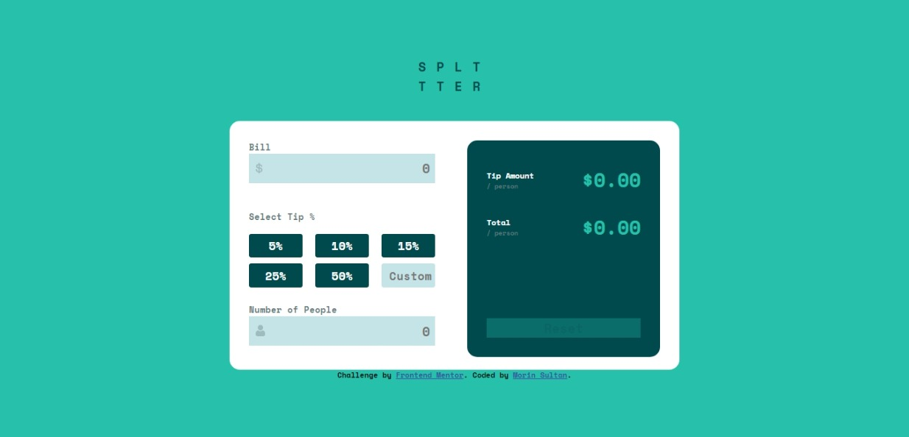

# Frontend Mentor - Tip calculator app solution

This is a solution to the [Tip calculator app challenge on Frontend Mentor](https://www.frontendmentor.io/challenges/tip-calculator-app-ugJNGbJUX). Frontend Mentor challenges help you improve your coding skills by building realistic projects.

## Table of contents

- [Overview](#overview)
  - [The challenge](#the-challenge)
  - [Screenshot](#screenshot)
  - [Links](#links)
- [My process](#my-process)
  - [Built with](#built-with)
  - [What I learned](#what-i-learned)
  - [Continued development](#continued-development)
  - [Useful resources](#useful-resources)
- [Author](#author)
- [Acknowledgments](#acknowledgments)

## Overview

### The challenge

Users should be able to:

- View the optimal layout for the app depending on their device's screen size
- See hover states for all interactive elements on the page
- Calculate the correct tip and total cost of the bill per person

### Screenshot




### Links

- Solution URL: [Solution URL](https://your-solution-url.com)
- Live Site URL: [live site](https://your-live-site-url.com)

## My process

### Built with

- Semantic HTML5 markup
- CSS custom properties
- Flexbox
- CSS Grid

### What I learned

While continuing my journey of learning JavaScript, I learnt about a new type of event type called blur

code snippets, see below:

```js
billValue.addEventListener("blur", function () {
  console.log(billValue.value);
});
```

### Continued development

- Javascript

### Useful resources

## Author

- Frontend Mentor - [@SoulOfMo](https://www.frontendmentor.io/profile/SoulOfmo)
- Twitter - [@morin_sultan](https://www.twitter.com/morin_sultan?s=09)


## Acknowledgments
